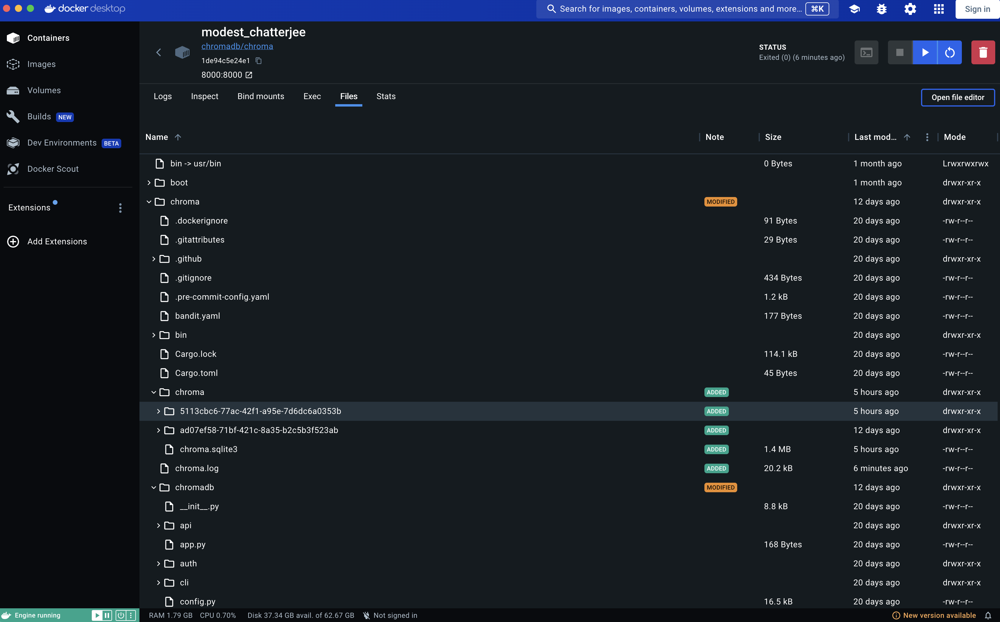
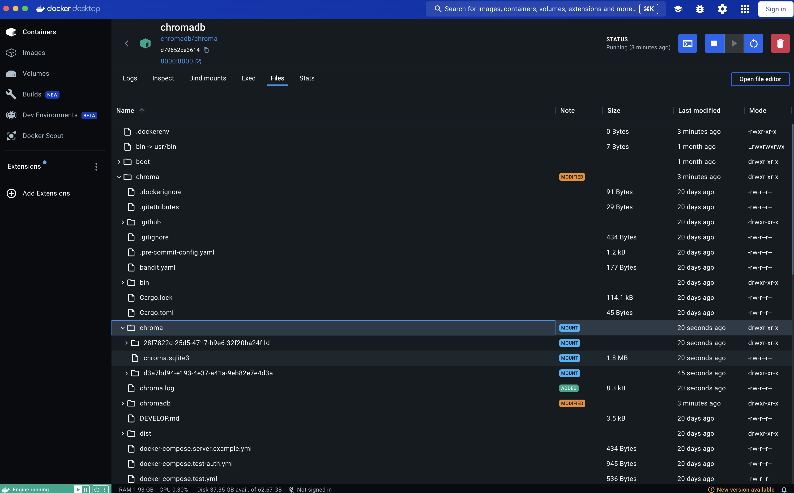

# Chromadb docker setup note

## Disk mount

Decided to mount the content of chromadb to our disk

- allow chromadb data to be first tested locally, then move it to run on server, without recreating them
- allow reuse of pre-created document embeddings

The path of the persistent storage for chromadb in the container is "/chroma/chroma"



Run the following command to create a container, and mount the data path of the storage in the docker to our disk

```terminal
docker run -d --name chromadb -v ./chromadb_storage:/chroma/chroma -p 8000:8000 chromadb/chroma
```

Explanation

```terminal
--name <the name of the container>

-v <the path in the disk>:<the path in the container>

-p <expose the port from container>:<to the port in the machine>

<last arg>: from which image
```

With mounting



Reference: https://medium.com/alberthg-docker-notes/docker%E7%AD%86%E8%A8%98-%E8%AE%93%E8%B3%87%E6%96%99%E9%81%A0%E9%9B%A2container-%E4%BD%BF%E7%94%A8-volume-bind-mount-%E8%88%87-tmpfs-mount-6908da341d11

