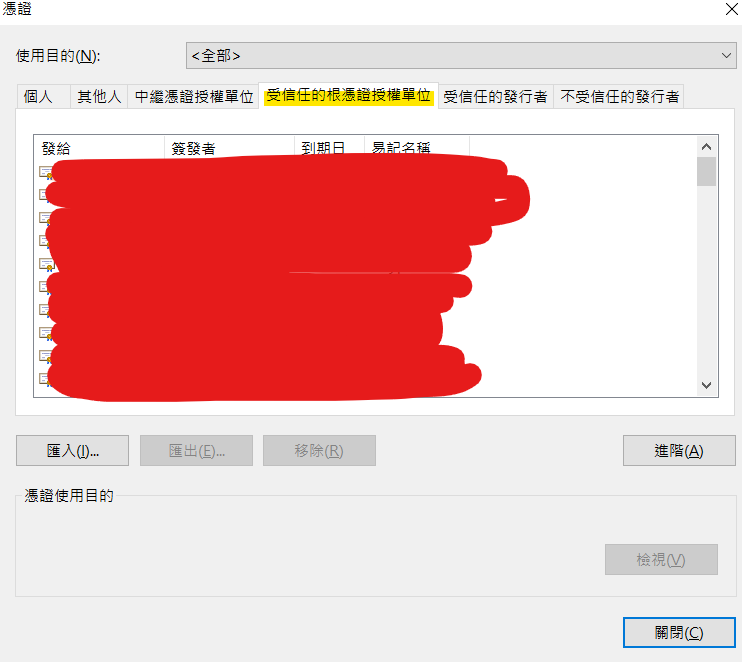

# HKU ChatGPT automation project

Automate HKU ChatGPT to create labels for sentiment analysis.

## Setup

You should have chrome installed.

requires the following packages. install as below

requires pandas >= 2.1.0, python = 3.9.18

```
pip install pandas==2.1.0
pip install selenium==4.12.0
pip install selenium-wire==5.1.0
pip install undetected-chromedriver==3.5.3
```

You can also import the environment I newly created for running this program on windows machines. The name of the yml file is _hkuchatgpt_env.yml_

## Usage

1. create a json file called _secret.json_ and place the json file in the same directory as the _hkuchatgpt.py_  
Then copy the template below to the json file.  
Fill in your own HKU email and pw

    ```json
    {
        "my_email":"<UID>@connect.hku.hk",
        "my_pw":"<your_password>"
    }
    ```

2. cd to this directory and run as below to test the functionality of the program. A test run result file will be created.
It runs 10 query which each costs on average 150 tokens.

    ```
    python hkuchatgpt.py
    ```

## Sentiment Analysis Workflow

I prepared a _main.py_ for running sentiment analysis labelling automatically using HKU ChatGPT 3.5 service.

I also prepared a folder of randomly sampled comments (which are not targetting any specific genre/a title) from the steam comment dataset sourced from Kaggle. The comments should have no foul language (as they are replaced with '♥' symbol), nor meaningless Early Review Access comments (with only "Early Review Access"), as I filtered them out in a separate script namely _create_dataset.ipynb_

Please go the the _main.py_ script and modify the name of the file to run with according to the instruction below.  
Notice the version of pandas should be >= 2.1.0, as stated in the section **Setup**. This is for reading and writing consistent pickle files.

### How to modify?

To _main.py_ script, the section:

```python
dataset_folder = Path('dataset_cleaned_heartless_sampled_20230927').resolve()
base_file = Path(dataset_folder, 'dataset_cleaned_heartless_sampled_20230927_chunk_000.pkl').resolve()
```

The variable _dataset_folder_ is the folder storing the sanpled comments, each with 3000 rows.

**Change the string of _base_file_ variable to be one of the different chunks in the folder _dataset_folder_. Example:**

```python
base_file = Path(dataset_folder, 'dataset_cleaned_heartless_sampled_20230927_chunk_001.pkl').resolve()
```

Then find the variable _NUM_OF_REQUEST_PER_SAVE_  
This variable is to create a checkpoint after NUM_OF_REQUESTS_PER_SAVE rows. Nodify the variable as you like.

```python
REQUESTS_PER_MINUTE = 6     # fixed constant, set by the API
# ...
NUM_OF_REQUESTS_PER_SAVE = REQUESTS_PER_MINUTE * 5
```

Then find the variable _BALANCE_LIMIT_  
This variable is to set the threshold of remaining tokens, such that the program will terminates, and saves all processed data, to avoid using all tokens available.

```python
BALANCE_LIMIT = 5000
```

For reviewing your results, I prepared a file called _read_dataset_from_pickle.ipynb_ to load and show the .pkl file.

## FAQs

## Certificate problem

The browser will show a window that the connection is not https, thus stopping the program from running.

Solution: download the certificate from github, section 'Certificates'. [Github](https://github.com/wkeeling/selenium-wire)  

### Mac solution
Then follow the instruction in stackoverflow to install the certificate.
[Stackoverflow](https://stackoverflow.com/questions/72201652/selenium-wire-your-connection-is-not-secure)

### Windows solution
Then follow the instruction to open certificate settings in chrome. [Chrome Help](https://support.google.com/chrome/answer/95617?visit_id=638315579362582898-249855116&p=root_store&rd=1#root_store&zippy=%2Cmanage-device-certificates-on-mac-windows)

Then a window like below should be pop up. Locate to the window/tab highlighted. Then inport the downloaded certificate.



After importing, you should see the certificate at the list. The name is "Selenium Wire CA".

If still not working, then locate to the third tab, and import the certificate again.

## Fine-tuning

For the messages to be sent to chatgpt, edit the messages parameter of the json in _main.py_

For other parameters, such as temperature, top_p, max_tok of chatgpt (which is Azure chatgpt), can add global parameters according to the stated examples in Azure chatgpt website. [Docs](https://learn.microsoft.com/en-us/azure/ai-services/openai/reference#completions).

The parameters can be added within the function _modify_gpt_request()_ in _hkuchatgpt.py_
